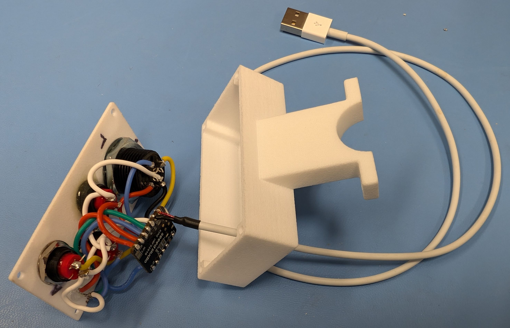
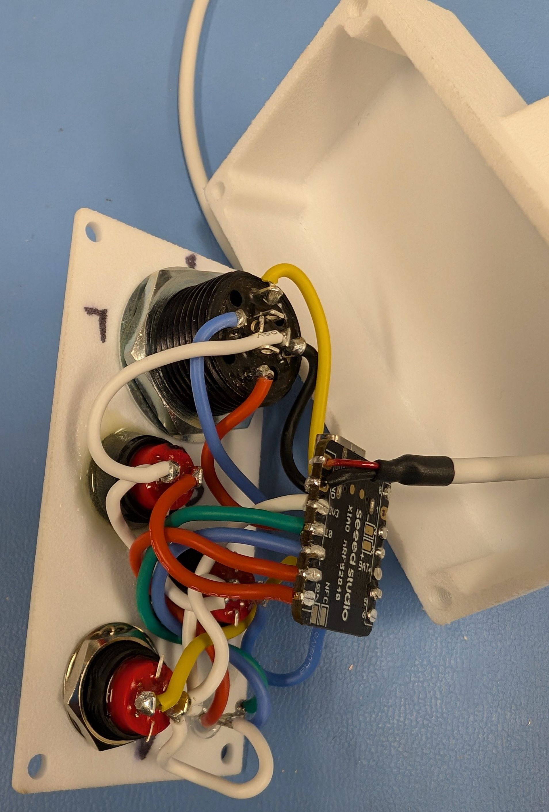
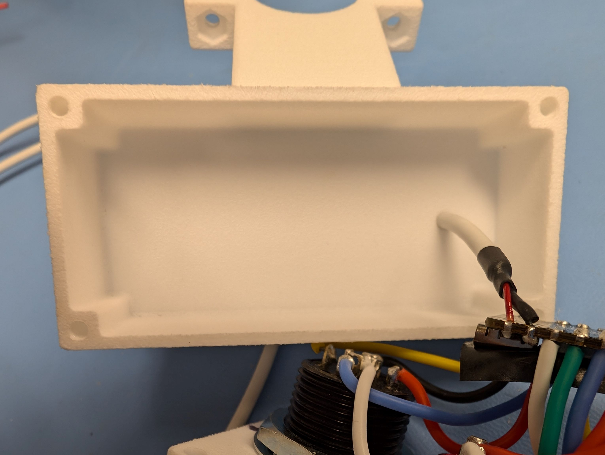
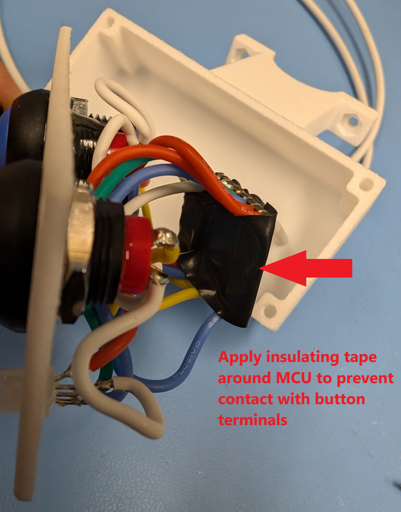
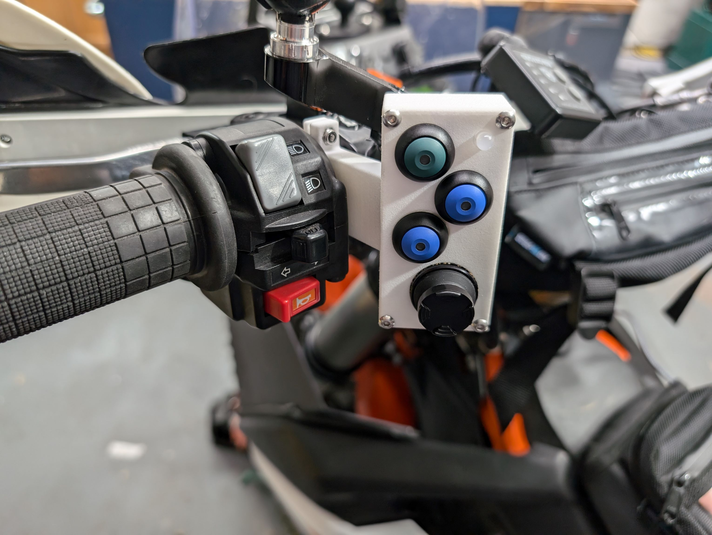
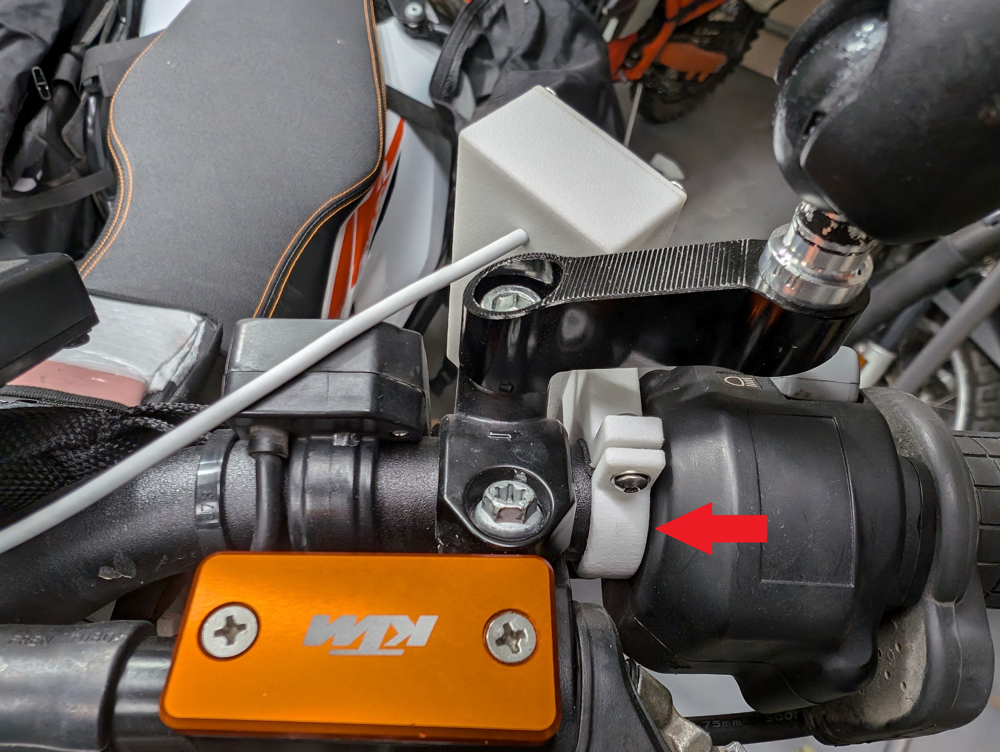

### Construction Guide 
Prior to assembly, you will need the following hardware to complete construction:
- Four M3x0.5 10 mm stainless button head screws (available at most Ace, TrueValue or similar hardware stores in the USA)
- Two M3x0.5 12 mm stainless button head screws
- Two M3 stainless lock nuts (stop nuts)
- Two M3 stainless washers
- A M3x0.5 tap for threading the holes in the case
- A #40 0.098-in (2.5 mm) drill bit for "tapping" (threading) the case holes
- A #31 0.120-in (3.00 mm) drill bit for creating "clear holes" in the case lid for the lid screws
- A piece of insulting electrical tape
- Some silicone RTV sealant (either clear or color matching to your case)
- 22 AWG or finer insulated wire
- An old USB cable (smaller diameter cable preferred) to provide 5V power to the MCU.

## Wiring Diagram
Please print out the [PDF wiring diagram](./Wiring_Diagram_MotoButtons2.pdf) prior to construction.

## Construction
Solder up the buttons, joystick, LED and MCU using 22 AWG or finer gauge wire. Find an old USB cable and cut one end off. The red and black (or uninsulated) wires should be the positive (5V) and ground wires, but please check this with a multimeter and USB charger prior to soldering! **Note: The buttons and LED are connected to the 3.3V output on the MCU, NOT the 5V pin!** Connecting the 5V supply to any other pins on the MCU will destroy it. 

You can solder all of the wires to the top of the MCU, except the 5V USB power can be soldered from the bottom.

Push the cut end of a USB cable through the hole in the back of the case. It is recommended to use a flexible, small diameter USB cable. However, depending on the diameter, you may need to drill the hole larger. **Ensure that the hole remains a tight fit such that the cable forms a very snug seal when pulled through the hole.**

After soldering, apply some insulating tape (such as electrical tape) around the top of the MCU so that it does not make contact with any of the terminals on the buttons.

The fully assembled unit will look as shown below. You will need to drill the top plate for **M3 screw** clear holes, #31 0.120-in US drill bit or 3.00 mm metric. Also, drill the blind holes in the case body with a #40 0.098-in (2.5 mm) drill bit, being careful not to drill through the case. Then tap the holes carefully with a **M3x0.5 metric tap.** Use 10 mm long M3x0.5 stainless screws to secure the lid to the case. **Make sure not to over torque the screws** or you will strip the plastic threads. You can use a bit of blue Loctite to keep the screws secure.

Finally, sealant can be applied around the lid to waterproof the case, but please remember to **program the MCU prior to final assembly.** You should also use something removable like silicone RTV, so that you can update the firmware. Use color matching or clear sealant and wipe off the excess after assembly. Let it fully cure before handling.

## Mounting

The unit is mounted to standard 22 mm handlebars between the switchgear and the left mirror/clutch lever mount. You will need to insert a thin piece of rubber or non-slip sheet (such as the liner for kitchen drawers or toolboxes) to go between the case's clamp and the handlebar.

Use 12 mm M3x0.5 metric screws and a M3 lock nut (stop nut) to secure the clamp to the case. The M3 nuts will go in the hex shaped holes on the case side, but it can help to put a little glue or grease on them to keep them from falling out while you thread the screws from the clamp side. Tighten only until the mount does not easily move--do not overtighten.

When mounting is complete, you should be able to activate the controls without fully releasing your grip from the handlebar, depending on your hand size.

