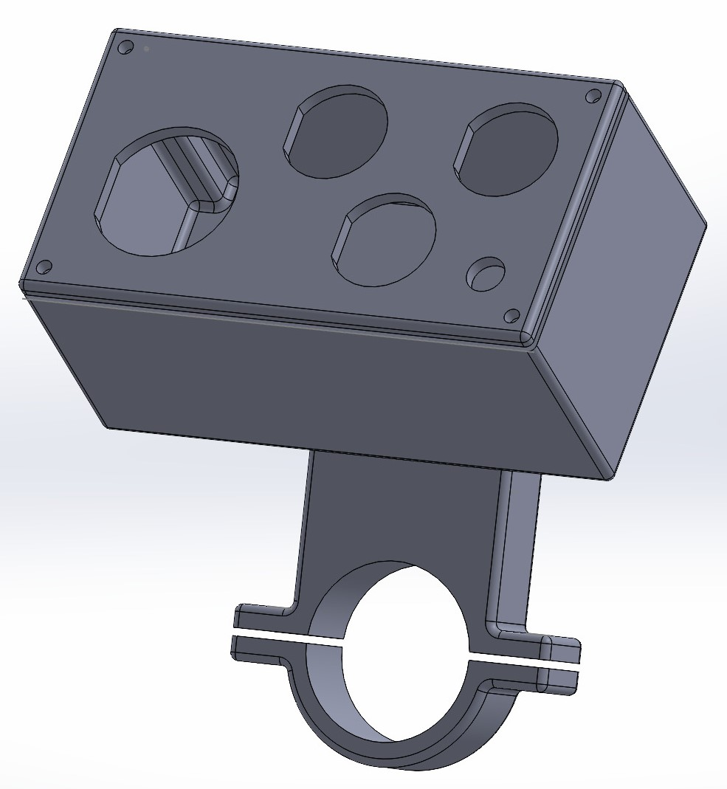

# MotoButtons 2

Welcome to MotoButtons 2, the low-cost, waterproof, DIY Bluetooth motorcycle controller. Version 2 features many upgrades over [the original](https://github.com/joncox123/MotoButtons):
- 3D printed case with handlebar mount
- Separate RGB LED for indicating modes and status
- Commercial, IP68 5-way castle joystick
- Three pushbuttons
- Optional lithium polymer rechargeable battery

  The target price to order all parts, including the case, is approximately $80 to $100 excluding shipping costs. The main variable is the cost and quality of the 3D printed case. The cheapest service for 3D printing is [Craftcloud](https://craftcloud3d.com/).

