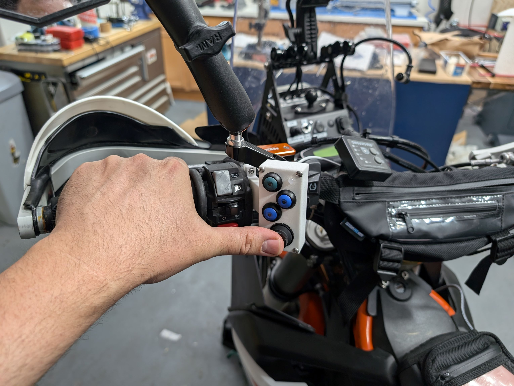
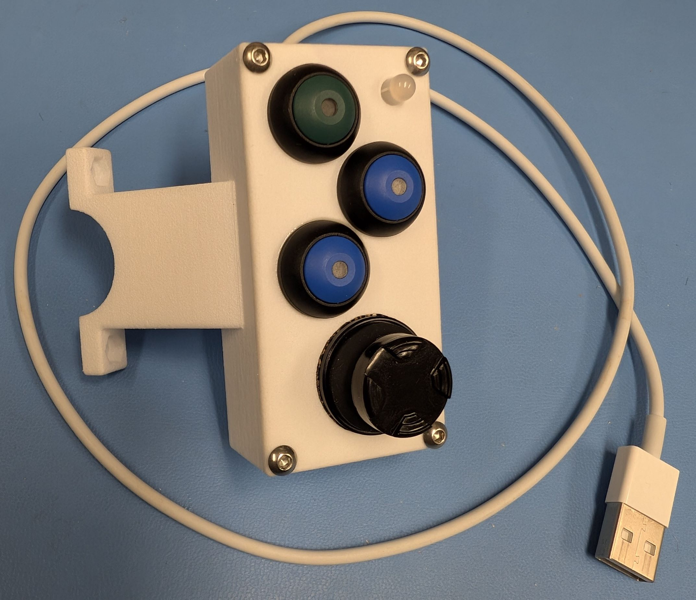
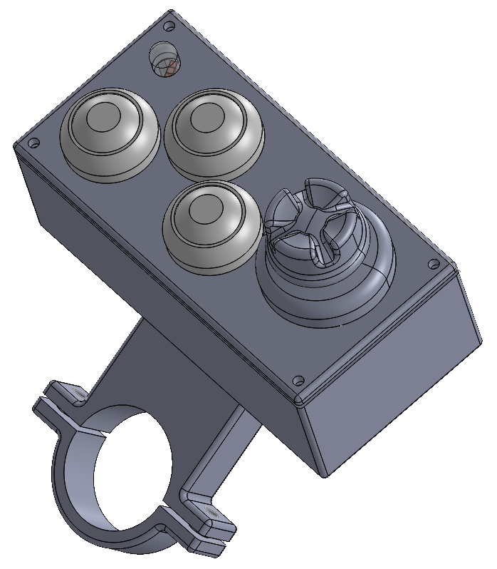
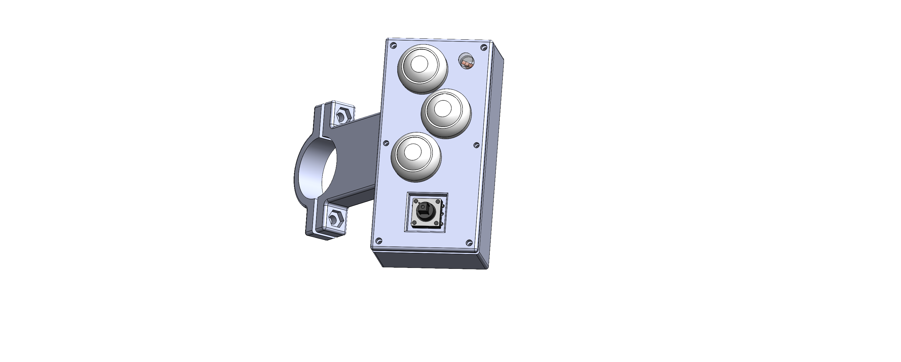

# MotoButtons 2
### MotoButtons 2 has reached the initial 2.0 release and is ready for users to build their own unit. You can build this either for a commercial, 4/5-way IP68 joystick, which costs $65 USD + shipping, or with the original $2.50 USD Adafruit 504 5-way joystick (as in MotoButtons Lite). However, construction is much easier either way because of the 3D printed Nylon case.

Click the image below to watch an [overview video](https://www.youtube.com/watch?v=i00laBGHPMg) of the project, the device and its operation on YouTube:

**If you have developed different or improved 3D printed case designs, please let me know via the Issues and I can either link to them here or add them to this repository.**

Please submit any bug reports via the Issues tab on this GitHub repository page.

### Welcome to MotoButtons 2, the low-cost, waterproof, DIY Bluetooth motorcycle controller. Version 2 features many upgrades over [the original](https://github.com/joncox123/MotoButtons):
- 3D printed case with handlebar mount
- Separate RGB LED for indicating modes and status
- Commercial, IP68 5-way (or 4-way) castle joystick ($65 USD + shipping)
  -  or the original $2.50 USD 5-way Adafruit joystick [see alternative case design](./CaseAdafruitJoystick/README.md)
- Three pushbuttons

The target price to order all parts, including the case, is approximately $80 to $100 excluding shipping costs. The main variable is the cost and quality of the 3D printed case. However, the most expensive part is the IP68 rated 5-way joystick. The cheapest available is from Ruffy Controls, although industry prices for similar parts vary from $45 to beyond $300. Lastly, the least expensive service for 3D printing is [Craftcloud](https://craftcloud3d.com/).

## User Documentation
Please see the **[User's Guide](./UsersGuide/README.md)** for instructions on how to use your MotoButtons 2.

## Assembly Steps

[1] Order your 3D printed case by uploading the three [CAD STEP files](./Case/Parts) to [Craftcloud](https://craftcloud3d.com/). If you are using the low-cost, Adafruit $2.50 USD 5-way joystick, use [this case model](CaseAdafruitJoystick/README.md) instead. Use the Nylon SLA material for printing, as the cheaper PLA filament will not be of satisfactory quality. You do not need to pay for any special finishings or other options beyond Nylon SLA.

[2] Order the parts from Digikey by [clicking this link](https://www.digikey.com/short/hzjjppm1), as listed in the [Bill of Materials](./Parts/BOM.csv). Note, due to shipping costs, it is cheaper to order several HS joysticks from Ruffy Controls at once. I recommend ordering one for each bike, or organize a group buy on a forum.

[3] Read the [wiring diagram and construction guide](./ConstructionGuide/README.md) to assemble your MotoButtons 2 after obtaining the parts and the case.

[4] Upload the software to the microcontroller using a USB-C cable and the Arduino program. See [this guide](./Programming/README.md) for detailed instructions.

### A case for the Ruffy 4/5-way joystick

### A case for the Adafruit 504 $2.50 USD 5-way joystick
See the STEP files [here](CaseAdafruitJoystick/README.md).

